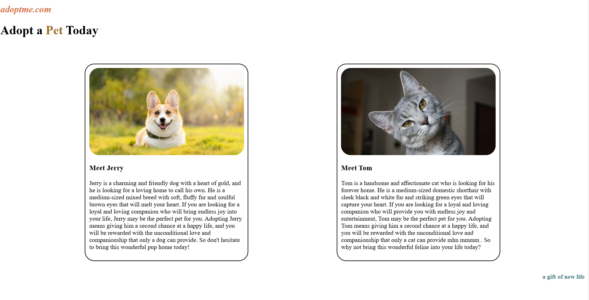

# Pet Adoption Page 🐶🐱

This is a basic static **HTML** and **CSS** webpage designed to showcase a pet adoption landing page. The page includes a simple layout, visual styling, and images of a dog and a cat.

## 📁 Project Structure

```text
Pet-adoption-page/
├── index.html         # Main HTML file
├── style.css          # CSS stylesheet
├── dog.png            # Dog image
├── cat.png            # Cat image
├── screenshot.png     # Screenshot for README
└── README.md          # Project documentation


## ✨ Features

- Clean and semantic HTML5
- Styled with basic CSS3
- Includes pet images
- Simple, beginner-friendly structure

## 🛠️ Technologies Used

- HTML5
- CSS3

## 🚀 How to Run Locally

1. Clone the repository:
   ```bash
   git clone https://github.com/anuj-singal/Pet-adoption-page.git

## 📷 Preview



## ✍️ Author
Anuj Singal
GitHub Profile
